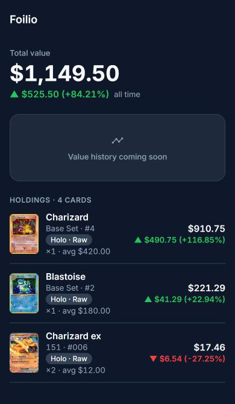
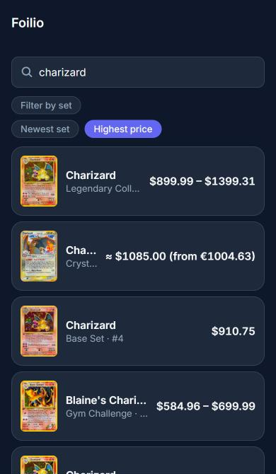
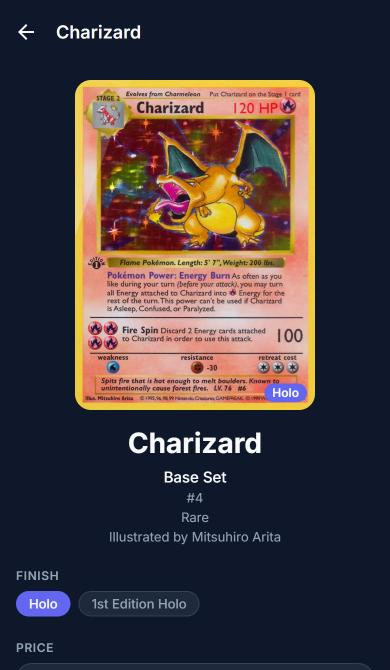
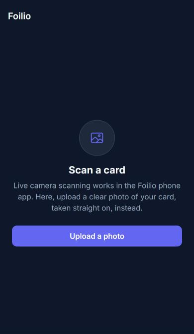

# Foilio

**Scan, price, and track your Pokémon card collection like a stock portfolio.**


[](LICENSE)

Foilio is an Expo (React Native) app for iOS, Android, and web from one TypeScript
codebase, plus a Python image-recognition pipeline for identifying cards from a photo.

## Screenshots

| Portfolio | Search | Card detail | Scan |
| :---: | :---: | :---: | :---: |
|  |  |  |  |

<sub>Captured from the web build at phone width. On a phone, the Scan tab opens the live camera with a card-outline guide.</sub>

## Features

### Built

- **Card search:** search the full TCGdex card catalog by name, filter by set, and sort by newest set or highest price.
- **Card detail:** artwork, set, rarity, and artist. Prices are shown **per finish** (Normal, Holo,
  Reverse Holo, 1st Edition…), plus one-tap eBay searches for raw and graded copies.
- **Portfolio:** add purchases with finish, raw/graded, quantity, price paid, and date. It shows
  total value and gain/loss for each holding and overall, in a brokerage-style dark UI.
  Saved on-device, so no account is needed.
- **Scanner, capture:** camera view with a card-outline guide on iOS/Android, and photo upload on web.
- **Scanner, recognition prototype (Python):** identifies a card from a photo by comparing
  DINOv2 image embeddings against an index of every card image.

### In progress / planned

- Run recognition on the phone and connect it to the Scan tab
- Automatic card cropping and accuracy testing on real phone photos
- Graded prices from active eBay listings (labeled as asking prices)
- Accounts and cloud sync (Supabase)
- Portfolio value-history chart

## Tech stack

| Area | Tools |
| --- | --- |
| App | Expo SDK 57, React Native, Expo Router, TypeScript, AsyncStorage |
| Card data | [TCGdex](https://tcgdex.dev) (free, no API key) |
| Card recognition | Python, PyTorch, Hugging Face Transformers, DINOv2-small, NumPy |
| Backend (planned) | Supabase free plan: Postgres, auth, edge functions |

## Architecture

An npm-workspaces monorepo:

```
apps/app/          Expo app: screens (src/app), components, portfolio, scanner, theme
packages/shared/   Card types, CardDataProvider + TCGdex adapter, portfolio store and math
ml/                Python scanner pipeline: download images → build index → match a photo
docs/              Roadmap and decision records (docs/decisions/)
supabase/          Backend, not started yet (planned schema in its README)
infra/             Deployment config, placeholder
```

Screens never call an API directly. They go through `CardDataProvider` and
`PortfolioStore` from `packages/shared`, so the data source or storage can be swapped
without touching UI code.

## Engineering highlights

- **Provider adapter pattern:** all card data goes through one `CardDataProvider`
  interface, currently backed by TCGdex. Switching sources means one new class and a
  one-line change. → [provider-adapter](docs/decisions/provider-adapter.md)
- **Per-finish pricing:** a reverse holo can be worth many times its normal print, so every
  price carries its finish. When the provider data is ambiguous (Cardmarket EUR prices
  have no finish), Foilio skips the price instead of guessing.
  → [pricing](docs/decisions/pricing.md)
- **Embedding-based scanner, no training:** a pretrained DINOv2 model turns each card into
  a 384-number fingerprint, and recognition is a nearest-neighbor lookup over about 22k cards
  that takes milliseconds. New sets only need re-indexing, not retraining.
  → [scanner](docs/decisions/scanner.md)
- **Why DINOv2, not CLIP:** CLIP groups images by meaning, so every Pikachu looks alike to
  it. DINOv2 focuses on visual detail like artwork and layout, which is what tells two
  printings apart. → [scanner](docs/decisions/scanner.md#why-dinov2-rather-than-clip)
- **Free-only constraint:** no paid APIs or plans. Because the free eBay API only shows
  active listings, graded prices will always be labeled as *asking* prices, never sold
  values. → [free-only](docs/decisions/free-only.md)
- **Local-first portfolio behind an interface:** works with no account today, and entries use
  UUIDs so a Supabase-backed `PortfolioStore` can replace local storage by changing one line.
  → [portfolio-storage](docs/decisions/portfolio-storage.md)

## Getting started

### App

Needs [Node.js](https://nodejs.org) LTS, plus the free **Expo Go** app on your phone.

```bash
npm install          # from the repo root, installs all workspaces
cd apps/app          # Expo must be run from apps/app, not the root
npx expo start       # scan the QR code with Expo Go, or press w for web
```

No API keys are needed. TCGdex is free and keyless.

### Scanner pipeline (optional)

Needs Python 3.11+. From `ml/` (Windows PowerShell shown; see [ml/README.md](ml/README.md)):

```powershell
python -m venv .venv
.\.venv\Scripts\Activate.ps1
pip install -r requirements.txt
python scripts/download_images.py      # ~22k card images (add --limit 50 for a quick test)
python scripts/build_index.py          # one embedding per card
python scripts/match.py path\to\photo.jpg
```

## Roadmap

Done: search, set filter, card detail with per-finish prices, on-device portfolio, scanner
capture, and the recognition prototype. Next: on-phone recognition, eBay graded asking
prices, accounts and sync, and value history. Full list in [docs/roadmap.md](docs/roadmap.md).

## License

[MIT](LICENSE) © 2026 Jackson Adams. The license covers this project's code only.

## Disclaimer

Foilio is an unofficial fan project. It is not affiliated with, endorsed by, or sponsored
by Nintendo, The Pokémon Company, Creatures, or Game Freak. Pokémon and all related names
and images are trademarks of their respective owners. Card data and images come from
[TCGdex](https://tcgdex.dev).
